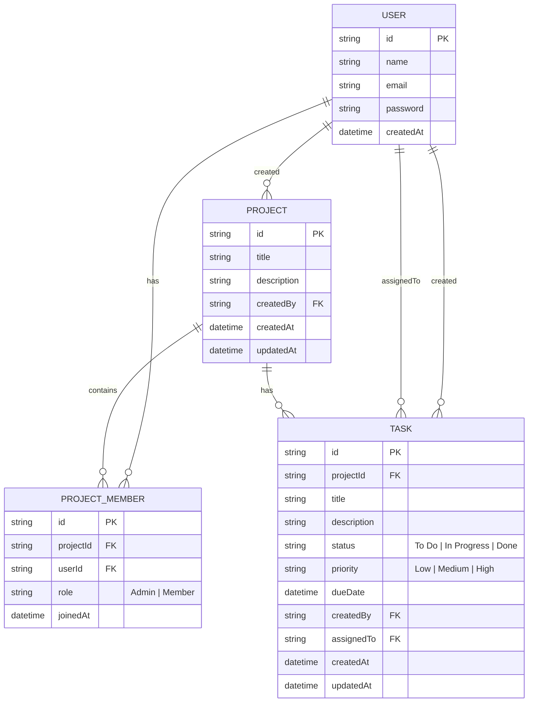

# Team Task Manager

A full-stack, production-grade project management application where teams can organize work into projects, assign tasks to members, and track real-time progress. Built as a lightweight alternative to Trello/Asana.

## Tech Stack Overview
- **Frontend**: React (Vite), TypeScript, Tailwind CSS (or Vanilla CSS based on preference), React Router, Axios, SWR/React Query.
- **Backend**: Node.js, Express, TypeScript, Zod (Validation), bcrypt, jsonwebtoken.
- **Database**: Prisma ORM, SQLite (local dev), PostgreSQL (Railway production).

## Local Development Setup

### 1. Clone the repository
```bash
git clone <repo-url>
cd team-task-manager
```

### 2. Install Dependencies
```bash
npm run install:all
```

### 3. Configure Environment Variables
Create a `.env` file in the `backend/` directory:
```env
DATABASE_URL="file:./dev.db"
JWT_SECRET="supersecretjwtkey"
PORT=5000
CLIENT_ORIGIN="http://localhost:5173"
```

### 4. Database Setup & Seeding
```bash
cd backend
npx prisma generate
npx prisma db push
npm run seed
```

### 5. Run the Application
From the root directory, you can build and start the application:
```bash
# Terminal 1: Start Backend (Dev Mode)
cd backend
npm run dev

# Terminal 2: Start Frontend
cd frontend
npm run dev
```

## Environment Variables Reference

| Variable | Description | Default / Example |
|----------|-------------|-------------------|
| `DATABASE_URL` | Prisma DB connection string | `"file:./dev.db"` (dev) / PostgreSQL URL (prod) |
| `JWT_SECRET` | Secret key for signing tokens | `supersecretjwtkey` |
| `PORT` | Backend server port | `5000` |
| `CLIENT_ORIGIN` | CORS allowed origin | `http://localhost:5173` |
| `NODE_ENV` | Application environment | `development` or `production` |

## Database Schema (ERD)



## API Endpoint Reference

### Authentication
- `POST /api/auth/register` - Register a new user. Body: `{ name, email, password }`
- `POST /api/auth/login` - Login. Body: `{ email, password }`

### Projects
- `GET /api/projects` - List all projects the user belongs to.
- `GET /api/projects/:id` - Get a single project.
- `POST /api/projects` - Create a project. Body: `{ title, description }`
- `POST /api/projects/:id/members` - Add a member to a project. Body: `{ email }` (Admin only)
- `DELETE /api/projects/:id/members/:userId` - Remove a member. (Admin only)
- `DELETE /api/projects/:id` - Delete project. (Admin only)

### Tasks
- `GET /api/projects/:id/tasks` - Get all tasks for a project.
- `GET /api/projects/:id/tasks/:taskId` - Get a specific task.
- `POST /api/projects/:id/tasks` - Create a task. Body: `{ title, description, assignedTo, status, priority, dueDate }` (Admin only)
- `PUT /api/projects/:id/tasks/:taskId` - Update task. (Member can only update `status` of their own tasks).
- `DELETE /api/projects/:id/tasks/:taskId` - Delete task. (Admin only)

### Dashboard
- `GET /api/dashboard` - Get dashboard statistics (Total tasks, tasks by status, overdue tasks, etc.).

## Demo Credentials (Seed Data)

The database includes demo users to test the application flows:

**Admin User** (Has full permissions)
- Email: `admin@example.com`
- Password: `password123`

**Member User** (Can only update their assigned tasks)
- Email: `member@example.com`
- Password: `password123`

## Railway Deployment Steps

1. **Login to Railway**: Go to [Railway.app](https://railway.app/) and create a new project.
2. **Add Database**: Select "Provision PostgreSQL".
3. **Connect GitHub**: Add your GitHub repository to the Railway project.
4. **Deploy Backend Service**:
   - Set Root Directory: `backend`
   - Build Command: `npm install && npx prisma generate && npm run build`
   - Start Command: `npx prisma migrate deploy && npm run start`
   - Environment Variables:
     - `DATABASE_URL` = (Automatically provided by Railway PostgreSQL)
     - `JWT_SECRET` = (Provide a secure string)
     - `PORT` = `5000`
     - `CLIENT_ORIGIN` = (URL of the frontend service once deployed)
5. **Deploy Frontend Service**:
   - Set Root Directory: `frontend`
   - Build Command: `npm install && npm run build`
   - Start Command: `npm run preview -- --host` (Or serve dist natively using a static server or Railway static deployment)
   - Environment Variables:
     - `VITE_API_URL` = (Backend public URL)
6. **Finalize**: Ensure the live URL is working and submit the demo video.
